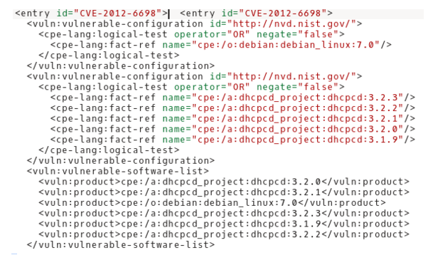

## 1. Pregunta

*Comparativas a nivel de seguridad de distintos grupos de productos. Por ejemplo partiremos de un listado de los distintos sistemas operativos.*

Esta pregunta será de utilidad para hacer elecciones de software ya que permitirá añadir a una comparativa un factor indicativo sobre su grado de vulnerabilidad respecto al resto de productos, pudiendo ser muy útil en entornos en que la seguridad es crítica para el negocio.

Inicialmente el objeto de estudio era responder a la pregunta de qué sectores profesionales tienen un mayor nivel de inseguridad. Para ello se quería realizar una comparativa del número de CVEs que afectan a cada sector. Para conseguirlo era básico conseguir una fuente pública de datos con listas de software categorizados por su uso en distintos sectores profesionales. En el estudio inicial sobre la disponibilidad de datos se ha conseguido obtener datos sobre la categorización de productos mediante UNSPSC pero se ha detectado que no llega a un nivel suficientemente bajo como para nombrar los distintos softwares de cada categoria. También se ha encontrado listas de software pero sin la categorización deseada, faltando así datos sobre la vinculación de los softwares y los distintos sectores. 

Debído a la dificultad de encontrar fuentes públicas con esta información se ha decidido reformular la pregunta siguiendo con la idea de aportar información sobre el grado de inseguridad pero en tipos de productos, en vez de en sectores

## 2. Conjunto ideal de datos

El conjunto ideal de datos sería un conjunto de listas de distintos productos cuya función sea la misma, para poder así realizar un estudio de, en cada momento, qué producto de cada tipo es más inseguro de cada lista y por lo tanto, menos recomendable. Pese a esto, una vez completado el proyecto, con unas pequeñas modificaciones, este podrá ser reutilizado para ver que sector es más vulnerable, comparando listas de productos en vez de productos de una lista. Pese a esto, inicialmente servirá para comparar el nivel de inseguridad de distintos productos como sistemas operativos, plataformas, software, CMSs,...cualquier conjunto de productos con un CPE y CVEs asociados.

Por los motivos anteriormente expuestos, inicialmente el conjunto ideal también podrá ser cualquier lista de productos con una característica comuna, responiendo así a la pregunta de, sobre una lista de productos con una característica en común, cuáles son los más inseguros. Más adelante, realizando las modificaciones pertinentes para comparar distintas listas de productos, el conjunto ideal será listas de productos correlacionados con sectores económicos en que se usan.

Además, también serán clave para el estudio los datos sobre la relación entre CPEs y CVEs para poder vincular los productos con sus vulnerabilidades.

Finalmente, datos sobre la relación entre el CVEs y CVSS también serán de vital importancia para poder cuantificar el nivel de inseguridad de los productos.

### 2.2 Conjuntos de datos accesibles

En la fase de investigación de fuentes de datos se han podido localizar el conjunto de datos necesario para llevar a cabo la fase inicial del proyecto.

Sobre los datos de productos del mismo tipo en formato lista, no se han encontrado en un formato facilmente parseable pero buscando en distintas webs se han podido recopilar de forma manual.

Respecto a los otros datos necesarios, han podido ser encontrados en fuentes abiertas y se ha podido disponer de ellos sin problemas. En concreto, se ha podido acceder por un lado a datos con la relación CPEs y CVEs y por otro lado a datos con la relación CVEs y CVSS, pudiendo conseguir al final los datos que se desean mediante la correlación de toda la información.

En una fase más avanzada del proyecto se ha encontrado que una fuente de datos muy útil podría ser la base de datos de productos de análisis de vulnerabilidades como Nesus o Nexpose pero, dada la naturaleza privada de tales datos y al descubrir la fuente en una fase avanzada del proyecto, no se ha podido hacer uso de tales datos.

Así pues, todos los datos necesarios son accesibles pero idealmente también seria perfecto para el proyecto encontrar una fuente de datos con listas de software por categorías. Aún así, realizando uno mismo la lista de softwares a comparar permite hacer un uso más personalizado del proyecto comparando el grado de inseguridad de aquellos productos en concreto que nos interesan.

### 2.3 Obtención de datos

Las distintas fuentes en que se han encontrado los datos son las siguientes:

**Lista de productos**: para las pruebas hemos hecho una recopilación manual de distintas webs para hacer el listado de sistemas operativos comerciales que serán el origen de nuestro estudio. El fichero resultante se encuentra junto con el código en el repositorio de GitHub, en concreto dentro de la carpeta **data** y el nombre del fichero es *SO.csv*

**Relación CPE-CVE-CVSS**: bajamos la fuente de las diferentes vulnerabilidades recogidas por el NIST en la NVD ( National Vulnerability Database). En el siguiente link encontramos xml (en formato zip) separados por años. En concreto trabajaremos con la versión de 2.0 de la sección *How to keep Up-to-date with the NVD data* [https://nvd.nist.gov/download.cfm ](https://nvd.nist.gov/download.cfm ) 

*la primeras versiones de nuestro programa se han basada en el xml de un sólo año, más adelante se aplicará el código para recurar toda la información de las vulnerabilidades de todos los años*

### 2.3 Análisis de la información a analizar

Se ha estudiado el esquema de los datos en crudo para poder dar unas pautas detalladas sobre qué tags del fichero habrá que localizar al realizar el código que recogerá los datos relevantes de los ficheros de entradas. 

En primer lugar, del fichero en el que aparece la relación entre vulnerabilidades (CVE) y los programas (CPE) a los que esta afecta, se ha observado que tiene el siguiente formato:



De este fichero se ha definido que se obtendrá el atributo id del tag <entry> para tener el CVE y el contenido del tag <vuln:product> contenido dentro del tag <vuln:vulnerable-software-list> contenido en el tag <entry> para obtener los CPE que afectan al CVE encontrado. De esta forma se obtendrá un dataframe que permitirá determinar los CVE que afectan a cada CPE.

## 3. Procesamiento de los datos

### 3.1 Limpieza de los datos y obtención de datos elegantes

Partiendo de la lista de productos, en nuestro caso sistemas operativos se construye un dataframe dónde se tiene el listado de todas las vulnerabilidades (CVE) por cada producto. Junto con esta información se añade el valor correspondiente de CPE para nuestro producto ( sistemas operativos), el score de la vulnerabilidad y el año de la publicación.

```{r mostrando datos elegantes,echo=FALSE, cache=TRUE}
library(vgjsmParser)
df <- vgjsmParser::vgjsmParser()
#to generate a formated table of the first 5 items of our df final
library(knitr)
df_2 <- head(df, 5)
kable(df_2,col.names = c("CVE","CPE","SCORE","AÑO","SO"),caption="CVE parseado por codigos CPE según SO")
```

### 3.2 Análisis de exploración de datos

Con los datos obtenidos de la búsqueda del listado de sistemas operativos que teníamos como datos de entrada hemos realizado una exploración entre las diferentes variables que teniamos en juego: los diferentes vulnerabilidades (CVE) por tipos de sistemas operativos, las vulnerabilidades por año.

```{r grafica barras año versus so, echo=FALSE}
suppressWarnings(library(ggplot2))
colnames(df) <- c("CVE","CPE","SCORE","YEAR","SO")
ggplot(data=df,aes(YEAR, fill=SO)) + geom_bar(stat="count", width=0.5) + ggtitle("Número de vulnerabilidades de SO al año")

```

```{r grafica puntos año versus cve, echo=FALSE}
ggplot(data=df,aes(YEAR,fill=CVE)) + geom_point(stat="count") + ggtitle("Número de vulnerabilidades por año") + labs(x="YEAR",y="NUM CVE") + theme(legend.position="none")
```

```{r grafica puntos riesgo por año, echo=FALSE}
#para que no salga ningun warning en toda la ejecucion
options(warn=-1)
ggplot(data=df,aes(YEAR,SCORE)) + geom_point() + stat_smooth() + ggtitle("Riesgo medio por año") + labs(x="YEAR",y="SCORE") + theme(legend.position="none")

```

```{r grafica num vulnerabilidades por año, echo=FALSE}
ggplot(data=df,aes(SO, fill=CVE)) + geom_bar(stat="count",width=0.5) + theme(legend.position="none") + labs(x="SO",y="NUM CVE") + ggtitle("Número de vulnerabilidades en total en todos los años del estudio y por SO") 
```

## 4. Respuesta a la pregunta


## 5. Código

EL código está asociado al repositorio de Github 

[https://github.com/Shotouke/vgjsmParser ]https://github.com/Shotouke/vgjsmParser 

### 5.1 Package

### 5.2 Test funcional
